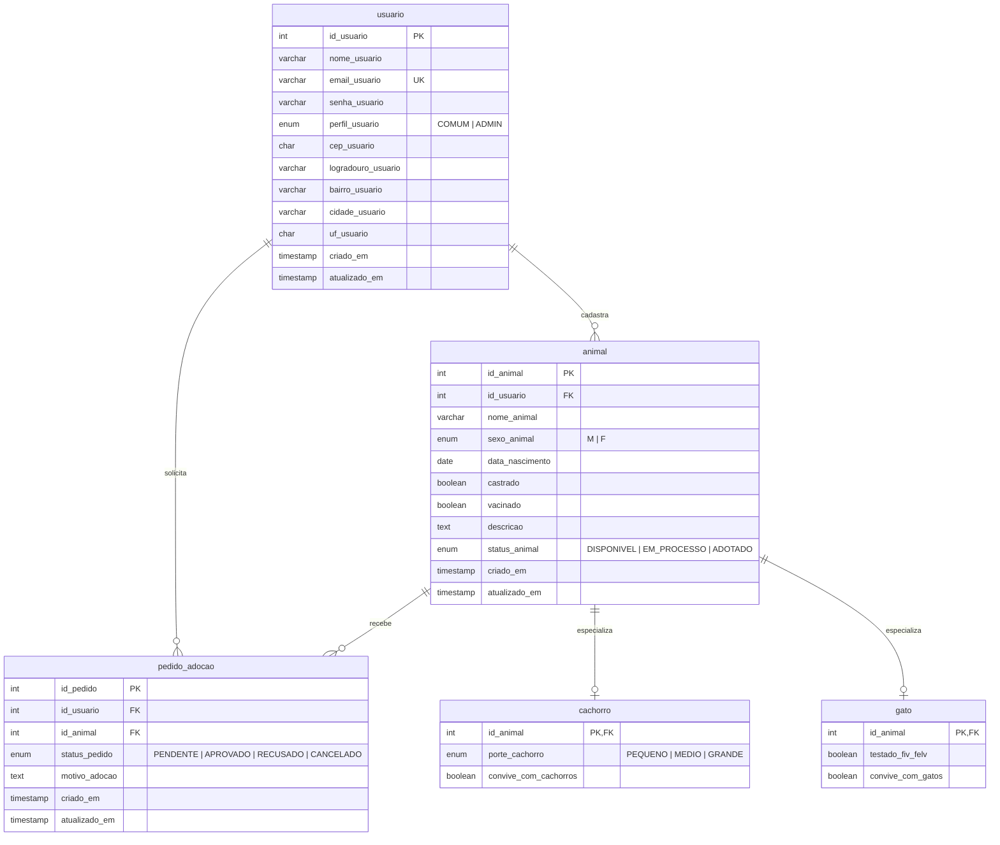

# Sistema de Adoção de Animais

API para gerenciar o processo de adoção de cães e gatos, conectando quem tem animais para doação a pessoas interessadas em adotar.

Projeto desenvolvido para o Desafio Back-end 2026/2 da Comp Júnior.

## Sumário

- [Sobre o sistema](#sobre-o-sistema)
- [Tecnologias](#tecnologias)
- [Entidades](#entidades)
- [DER](#der)
- [Regras de negócio](#regras-de-negócio)
- [Perfis e permissões](#perfis-e-permissões)
- [Integração externa](#integração-externa)
- [Arquitetura](#arquitetura)
- [Configuração e execução](#configuração-e-execução)
- [Endpoints](#endpoints)
- [Collection](#collection)

## Sobre o sistema

**Categoria:** sistema de gerenciamento do processo de adoção.

Usuários cadastram animais disponíveis para adoção. Outros usuários fazem pedidos de adoção, que o dono do animal aprova ou recusa. O sistema acompanha o status de cada animal e de cada pedido até a adoção ser concluída.

**Inclui:** cadastro e autenticação de usuários, endereço preenchido pelo CEP, cadastro de cães e gatos, pedidos de adoção com aprovação e recusa, recuperação de senha por e-mail.

**Não inclui:** pagamentos, chat entre usuários, agendamento de visitas.

## Tecnologias

- Node.js 22 com JavaScript
- Express 5
- PostgreSQL 17
- Prisma ORM 6
- Docker e Docker Compose

## Entidades

| Entidade | Descrição |
|---|---|
| **Usuário** | Pessoa que usa o sistema, com perfil `COMUM` ou `ADMIN` e endereço obtido pelo CEP. |
| **Animal** | Dados comuns a todo animal: nome, sexo, castração, vacinação, descrição, status e dono. |
| **Cachorro** | Dados exclusivos de cães: porte e convivência com outros cães. |
| **Gato** | Dados exclusivos de gatos: teste de FIV/FeLV e convivência com outros gatos. |
| **Pedido de Adoção** | Solicitação de um usuário para adotar um animal, com motivo e status. |

**Decisões de modelagem**

- **Especialização de animais:** os dados comuns ficam em `animal` e os exclusivos de cada espécie ficam em `cachorro` e `gato`, ligados 1:1 a `animal` pelo próprio `id_animal`. Isso evita colunas duplicadas e campos sem sentido para a outra espécie.
- **Pedido ligado diretamente a um usuário e a um animal (1:N):** cada pedido é de um único adotante para um único animal. Assim o próprio banco impede pedidos ambíguos, e as regras de aprovação ficam simples.
- **Pedidos não são excluídos, e sim cancelados**, para manter o histórico do processo de adoção.

## DER



O schema correspondente está em `prisma/schema.prisma`.

## Regras de negócio

### Usuários
- O e-mail é único. E-mail já cadastrado retorna `409`.
- A senha é armazenada apenas como hash e nunca é retornada nas respostas.
- O CEP deve ter 8 dígitos (formato inválido retorna `400`). Logradouro, bairro, cidade e UF são preenchidos pelo ViaCEP; CEP inexistente retorna `422`, e ViaCEP indisponível retorna `503` sem salvar dados.

### Animais
- Todo animal é cadastrado como cachorro ou como gato, com os dados específicos da espécie. O animal e seus dados específicos são criados na mesma transação.
- Só o dono do animal ou um administrador pode editá-lo ou excluí-lo.
- Animal com status `ADOTADO` não pode ser excluído, para preservar o histórico.

### Pedidos de adoção
- O usuário não pode pedir para adotar o próprio animal.
- Só é possível pedir animais com status `DISPONIVEL` ou `EM_PROCESSO`, e cada usuário pode ter apenas um pedido ativo por animal.
- O primeiro pedido muda o animal para `EM_PROCESSO`.
- Só o dono do animal (ou um administrador) aprova ou recusa. Ao aprovar, o animal vira `ADOTADO` e os demais pedidos pendentes dele são recusados automaticamente.
- O adotante pode cancelar o próprio pedido enquanto estiver `PENDENTE`.
- `APROVADO`, `RECUSADO` e `CANCELADO` são status finais.
- Não existe exclusão de pedidos: eles são cancelados, para manter o histórico.

## Perfis e permissões

| Recurso | Ação | Usuário Comum | Administrador |
|---|---|---|---|
| Usuário | Ver e editar o próprio perfil | ✅ | ✅ |
| Usuário | Listar e excluir outros usuários | ❌ | ✅ |
| Animal | Cadastrar | ✅ | ✅ |
| Animal | Listar e visualizar | ✅ | ✅ |
| Animal | Editar e excluir | Somente os próprios | ✅ |
| Pedido | Criar | ✅ (exceto para animal próprio) | ✅ |
| Pedido | Aprovar e recusar | Somente pedidos dos próprios animais | ✅ |
| Pedido | Cancelar | Somente os próprios, se pendentes | ✅ |

## Integração externa

**ViaCEP** (https://viacep.com.br): no cadastro e na edição de usuários, a API preenche logradouro, bairro, cidade e UF a partir do CEP. Isso padroniza o endereço e permite filtrar animais por cidade e estado do dono. A API é gratuita e não exige chave.

## Arquitetura

O projeto segue princípios de Clean Architecture, com as dependências apontando para dentro (as regras de negócio não dependem de Express nem de Prisma):

```
src/
├── domain/             # Regras e conceitos do negócio, sem dependências externas
│   └── errors/         # Erros de aplicação (AppError)
├── application/
│   └── use-cases/      # Casos de uso (orquestram as regras de negócio)
├── infra/
│   └── database/       # Acesso ao banco com Prisma
├── interfaces/
│   └── http/           # Rotas e middlewares do Express
├── app.js              # Montagem da aplicação Express
└── server.js           # Inicialização do servidor
```

Todos os erros passam por um middleware global (`interfaces/http/middlewares/errorHandler.js`), que devolve respostas no formato `{ "error": { "message": "..." } }` e nunca expõe detalhes internos.

## Configuração e execução

### Pré-requisitos
- [Docker Desktop](https://www.docker.com/products/docker-desktop/) (ou Docker Engine com Docker Compose)
- Git

### Passos

1. Clone o repositório:
```bash
   git clone https://github.com/IsadoraRB-dge/Trilha-Backend-CompJr.git
   cd Trilha-Backend-CompJr
```
2. Crie o arquivo `.env` a partir do exemplo. Os valores padrão já funcionam para rodar localmente:
```bash
   cp .env.example .env
```
   No Windows (PowerShell): `Copy-Item .env.example .env`
3. Suba o ambiente:
```bash
   docker-compose up --build
```
   O banco é iniciado, as migrations são aplicadas automaticamente e a API fica disponível em `http://localhost:3000`.
4. Verifique se está tudo funcionando:
```bash
   curl http://localhost:3000/health
```
   Resposta esperada: `{"status":"ok","database":"ok"}`

### Variáveis de ambiente

| Variável | Descrição | Padrão |
|---|---|---|
| `POSTGRES_USER` | Usuário do PostgreSQL | `admin` |
| `POSTGRES_PASSWORD` | Senha do PostgreSQL | `adocao_dev` |
| `POSTGRES_DB` | Nome do banco | `adocao` |
| `POSTGRES_PORT` | Porta do PostgreSQL no seu computador | `5433` |
| `API_PORT` | Porta da API no seu computador | `3000` |
| `DATABASE_URL` | URL do banco usada pelo Prisma fora do Docker | ver `.env.example` |

Se alguma das portas já estiver em uso no seu computador, altere `POSTGRES_PORT` ou `API_PORT` no `.env`.

### Desenvolvimento sem Docker para a API (opcional)

Com o banco rodando pelo Docker (`docker-compose up -d db`):
```bash
npm install
npx prisma migrate dev
npm run dev
```

## Endpoints

| Método | Caminho | Descrição | Acesso |
|---|---|---|---|
| GET | `/health` | Verifica se a API e o banco estão no ar | Público |

**Exemplo de resposta (`200`):**
```json
{ "status": "ok", "database": "ok" }
```

**Banco indisponível (`503`):**
```json
{ "error": { "message": "Banco de dados indisponível" } }
```

Os demais endpoints serão documentados conforme forem implementados.

## Collection

A collection do Postman será adicionada em `docs/collection.json` conforme os endpoints forem implementados.
